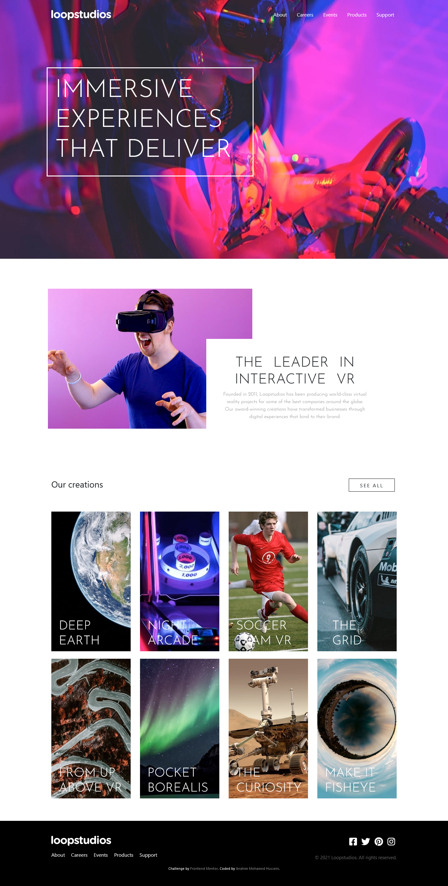
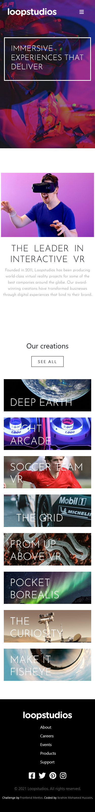

# Frontend Mentor - Loopstudios landing page solution

This is a solution to the [Loopstudios landing page challenge on Frontend Mentor](https://www.frontendmentor.io/challenges/loopstudios-landing-page-N88J5Onjw). Frontend Mentor challenges help you improve your coding skills by building realistic projects.

## Table of contents

- [Overview](#overview)
  - [The challenge](#the-challenge)
  - [Screenshot](#screenshot)
  - [Links](#links)
- [My process](#my-process)
  - [Built with](#built-with)
- [Author](#author)

## Overview

### The challenge

Users should be able to:

- View the optimal layout for the site depending on their device's screen size
- See hover states for all interactive elements on the page

### Screenshot

- Desktop view:

- Mobile view:

### Links

- Solution URL: [Loopstudios landing page w/ Bootstrap and Jquery](https://www.frontendmentor.io/challenges/loopstudios-landing-page-N88J5Onjw/hub/loopstudios-landing-page-w-bootstrap-and-jquery-P8l8Dww_hm)
- Live Site URL: [Frontend Mentor | Loopstudios landing page](https://ibrahim-mohamedh.github.io/Loopstudios-landing-page/)

## My process

### Built with

- Semantic HTML5 markup
- CSS custom properties
- Bootstrap
- Jquery - For menu interaction and changing images based on device's screen
- [WOW Animation](https://wowjs.uk/) - For Animation

## Author

- Website - [Ibrahim-MohamedH](https://github.com/Ibrahim-MohamedH)
- Frontend Mentor - [@Ibrahim-MohamedH](https://www.frontendmentor.io/profile/Ibrahim-MohamedH)
